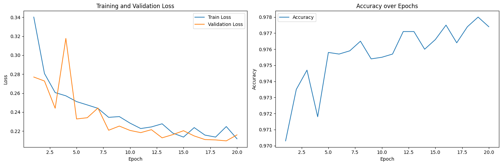
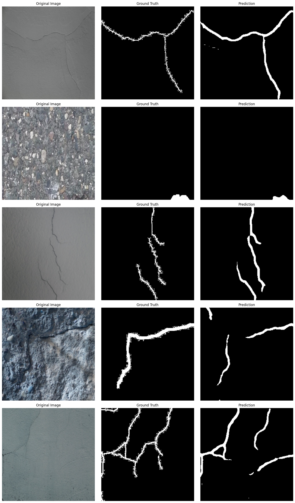

# 🧱 Crack Segmentation in Buildings using Deep Learning

> A deep learning-based semantic segmentation project to detect cracks in building surfaces using FPN, DeepLabV3+, and Attention U-Net. Includes a Streamlit-based app for real-time predictions.

---

## 🚀 Project Summary

Cracks in buildings, if left undetected, can lead to major structural failures. Manual inspection is often slow, inconsistent, and expensive. This project leverages **semantic segmentation models** to automatically detect cracks in building images — improving accuracy, speed, and scalability in infrastructure assessment.

---

## 🧠 Models Implemented

We implemented and evaluated three powerful architectures:

- 🔹 **FPN (Feature Pyramid Network)** – Multi-scale detection
- 🔹 **DeepLabV3+** – Uses dilated convolutions with ASPP for context-aware segmentation
- 🔹 **Attention U-Net** – Focuses on crack regions using attention gates

Each model was trained to segment cracks at the **pixel level** using a Kaggle dataset.

---

## 📊 Dataset

- **Source**: [Kaggle – Crack Segmentation Dataset](https://www.kaggle.com/datasets/lakshaymiddha/crack-segmentation-dataset)
- **Preprocessing Steps**:
  - Image resize to 256×256
  - Normalization (ImageNet mean & std)
  - Augmentation: flipping, rotation, noise, brightness/contrast adjustment

---

## ⚙️ Training Details

- **Loss Function**: Binary Cross Entropy with Logits
- **Optimizer**: Adam (learning rate = 1e-4)
- **Epochs**: 20
- **Validation Split**: 20%
- **Evaluation Metrics**: Accuracy, F1 Score, IoU

---

## 📈 Model Performance

| Model           | Accuracy | F1 Score | IoU    |
|----------------|----------|----------|--------|
| FPN            | 0.9787   | 0.6921   | 0.5316 |
| DeepLabV3+     | 0.9780   | 0.6870   | 0.5257 |
| **Attention U-Net** | **0.9792**   | **0.6870**   | **0.5261** |

> ✅ **Attention U-Net** showed superior crack localization due to attention-based skip connections.

---

## 📉 Training Curves

| FPN | DeepLabV3+ | Attention U-Net |
|-----|------------|-----------------|
|  |  |  |

---

## 🔍 Sample Predictions

| FPN | DeepLabV3+ | Attention U-Net |
|-----|------------|-----------------|
|  |  |  |

---

## 🖥️ Streamlit Web App

Developed a lightweight Streamlit app for testing the trained models:

### ▶ Features:
- Upload building images
- Choose from the three models
- View crack masks instantly

